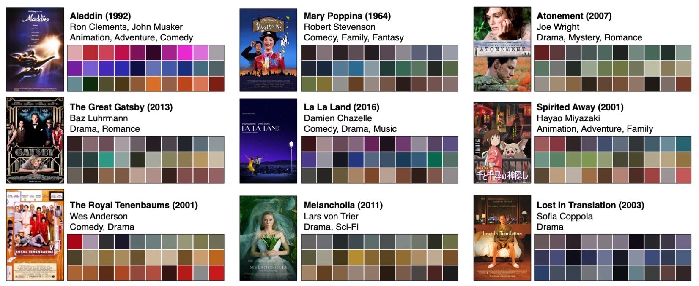
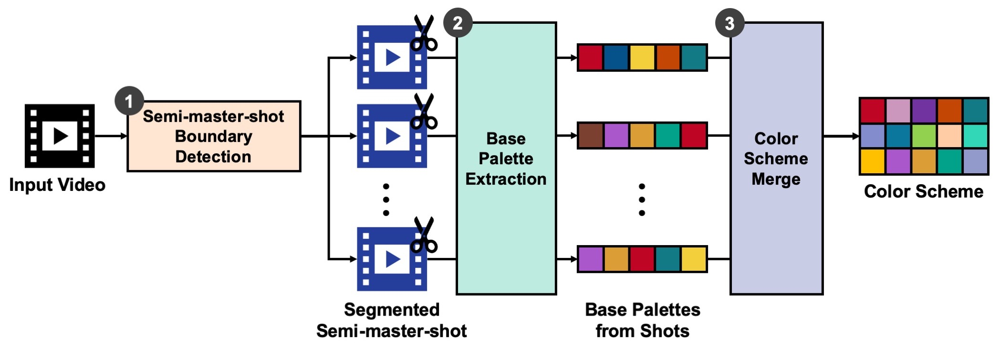
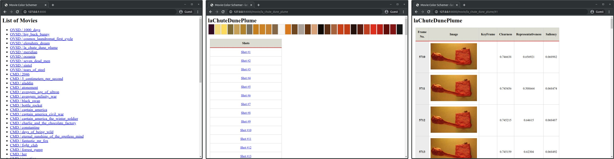
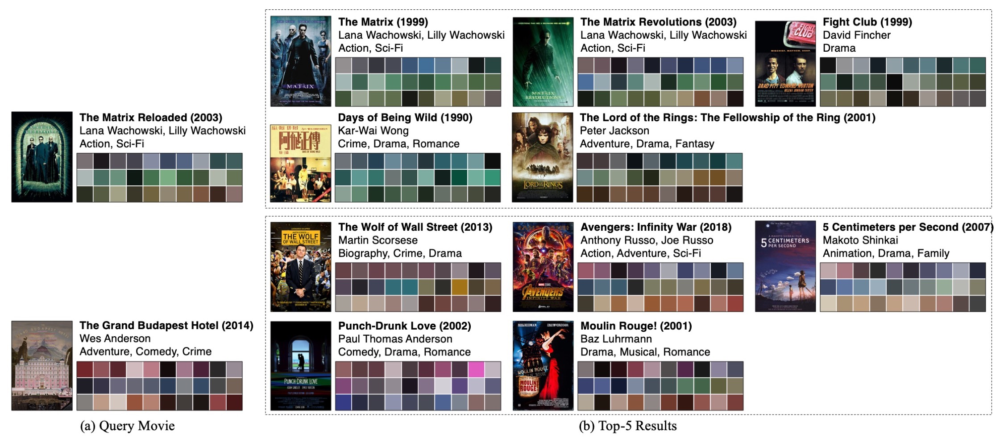
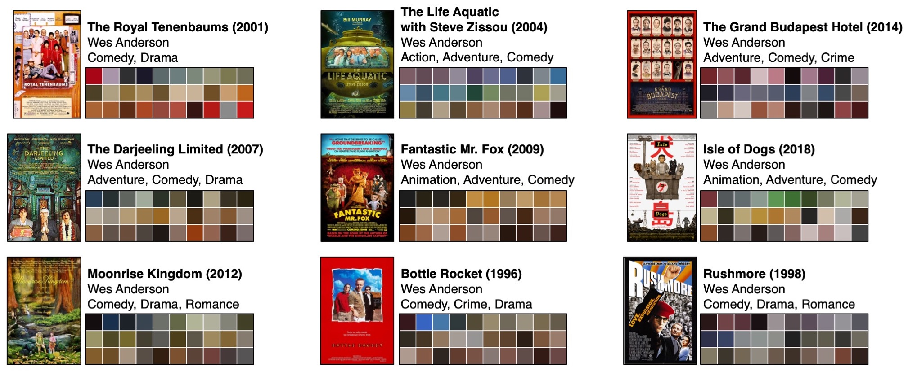
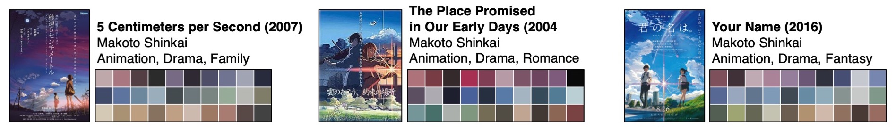
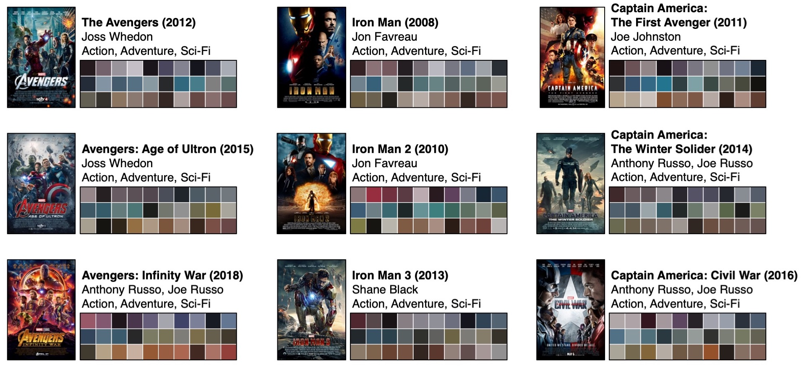
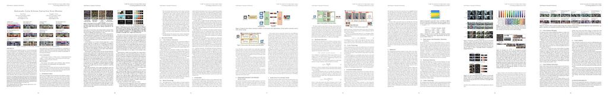

# Automatic Color Scheme Extraction from Movies

  

[Automatic Color Scheme Extraction from Movies](https://doi.org/10.1145/3372278.3390685)  
[Suzi Kim](https://kimsuzi.com/cv) and Sunghee Choi  
[Geometric Computing Lab.](https://gclab.kaist.ac.kr), [School of Computing](https://cs.kaist.ac.kr), [KAIST](https://kaist.ac.kr)  
Presented at [2020 ACM International Conference on Multimedia Retrieval (ICMR)](http://www.icmr2020.org/)

## Abstract

A color scheme is an association of colors, i.e., a subset of all possible colors, that represents a visual identity. We propose an automated method to extract a color scheme from a movie. Since a movie is a carefully edited video with different objects and heterogeneous content embodying the director's messages and values, it is a challenging task to extract a color scheme from a movie as opposed to a general video filmed at once without distinction of shots or scenes. Despite such challenges, color scheme extraction plays a very important role in film production and application. The color scheme is an interpretation of the scenario by the cinematographer and it can convey a mood or feeling that stays with the viewer after the movie has ended. It also acts as a contributing factor to describe a film, like the metadata fields of a film such as a genre, director, and casting. Moreover, it can be automatically tagged unlike metadata, so it can be directly applied to the existing movie database without much effort. Our method produces a color scheme from a movie in a bottom-up manner from segmented shots. We formulate the color extraction as a selection problem where perceptually important colors are selected using saliency. We introduce a semi-master-shot, an alternative unit defined as a combination of contiguous shots taken in the same place with similar colors. Using real movie videos, we demonstrate and validate the plausibility of the proposed technique.



## How to Run

Our system consists of three modules: semi-master-shot boundary detection (SBD), base palette extraction (BPE), and color scheme merge (CSM). Unfortunately, three modules are not integrated together, so you should run the module step by step.

|    | Directory | Language | Outputs|
|----|-----------|----------|-----------------------------------|
|SBD | 1-SBD     | C++      | txt file including shot boundary  |
|BPE | 2-BPE     | Matlab   | base palettes                     |
|CSM | 3-CSM     | Python   | color scheme images and hex file |

### Installation
- Clone this repo:  
```bash
$ git clone https://github.com/SuziKim/ICMR2020-MovieColorSchemer.git
$ cd ICMR2020-MovieColorSchemer
```

### Dataset
We evaluate our method on two datasets: OVSD and a commercial movie dataset. The movies were encoded at 24 fps, resized 320 pixels wide, and opening and closing credits were discarded. Download the dataset and place them under the ICMR2020-MovieColorSchemer directory as follows:
```bash
ICMR2020-MovieColorSchemer
└── videos
    ├── CMD
    │   ├── atonement.avi
    │   ├── forrest_gump.avi
    │   ├── ...
    │   └── life_of_pi.avi
    └── OSVD
        ├── la_chute_dune_plume.avi
        ├── elephants_dream.avi
	├── ...
        └── tears_of_steel.avi
```

#### (1) OVSD
- [Open Video Scene Detection Dataset (OVSD)](https://www.research.ibm.com/haifa/projects/imt/video/Video_DataSet.shtml)
- OVSD is an open dataset of Creative Commons licensed videos freely available for download and use, comprising 21 short or full-length movies from various genres, e.g. drama, animation, crime, sci-fi, etc. OVSD is designed for scene detection, and the composition of the movie is aesthetically insufficient to evaluate the color scheme extraction. 

#### (2) Commercial Movie Dataset (CMD)
To compare the final color scheme results, we use a commercial movie dataset instead of the OVSD. Although movies contain richer narrative patterns of shots and scenes compared with those general videos, there is no dataset targeting commercial movies due to copyright issues. We collect the commercial movie dataset particularly to compare current works
by artists or descriptor roles. The dataset contains 53 movies from various genres, including Inception, Atonement, Charlie and the Chocolate Factory, Days of Being Wild, Forrest Gump, Eternal Sunshine of the Spotless Mind, Her, La La Land, Life of Pi, Mary Poppins, Melancholia, Oldboy, Punch-Drunk Love, Spirited Away, The Avengers, The Grand Budapest Hotel, The Matrix, Your Name, etc. 


### Prerequisite
- Visual Studio 2013 or higher (We tested on the Visual Studio 2019)
	- Platform toolset to Visual Studio 2013 (v120)
- CUDA, cuDNN, Theano
	- We tested on CUDA 9.1 and cuDNN v.7.0.5 which are compatible with Theano 1.0.4.

### (1) Semi-master-shot Boundary Detection (SBD)

We adopt the [Imagelab Shot Detector (ILSD)](https://aimagelab.ing.unimore.it/imagelab/researchActivity.asp?idActivity=019) segmentation method, which only considers RGB colors. 

We acquire semi-master-shots mitigating the threshold  to determine the color difference between shots. To enhance the function of the safe zone, we use , which is proportional to the average length of shots, instead of the fixed value of .

We added three functions to the ILSD code.
- making it get an additional parameters:  
- rather than the fixed , calculating  according to the average shot length by the original .
- generating a subtitle file (.srt) to check the segmentation results visually.

We only modified the main.cpp file and left the comment with the tag 'ICMR2020-Suzi' in the code where we modified from the original ILSD.

You can build '1-SBD' directory on the Visual Studio with 'Release x64' configuration, and it generates 'SBD.exe' binary file. 
Then, to get a semi-master-shot boundary information,
```bash
.\1-SBD\x64\Release\SBD.exe <video_file_path> <W> <T>
```

and it generates a shot boundary file at _results/semi-master-shots/\<dataset\>/\<video_file_name_shots.txt\>_ as follow:
```
start_frame_of_shot#1 end_frame_shot#1
start_frame_of_shot#2 end_frame_shot#2
...
```

### (2) Base Palette Extraction (BPE)

BPE gets two inputs: (1) a video file and (2) semi-master-shot file, which are acquired from the SBD stage. 

To calculate the saliency map, we adopt the [SalGAN](https://github.com/imatge-upc/salgan). Download the two pretrained models [VGG-16 weights(vgg16.pkl)](https://imatge.upc.edu/web/sites/default/files/resources/1720/saliency/2017-salgan/vgg16.pkl) and [SalGAN generator model(gen_modelWeights0090.npz)](https://imatge.upc.edu/web/sites/default/files/resources/1720/saliency/2017-salgan/gen_modelWeights0090.npz), and put them under _saliency-salgan-2017/_ directory.

The whole process of the BPE is done by following code:
```
$ sudo matlab -nojvm -nodesktop -nosplash
>> setenv LD_LIBRARY_PATH matlabroot/bin/glnxa64:matlabroot/sys/os/glnxa64 
>> addpath '2-BPE'
>> BPE('OVSD', 'la_chute_dune_plume.avi')
```

### (3) Color Scheme Merge (CSM)

CSM is based on ["Decomposing Images into Layers via RGB-space Geometry"](https://github.com/CraGL/Decompose-Single-Image-Into-Layers) by Jianchao Tan, Jyh-Ming Lien, and Yotam Gingold in ACM Transactions on Graphics (TOG). To visualize the results, CSM is implemented on by using [Django](https://www.djangoproject.com/). Before you run the CSM, you should import the cost csv files, which generated from the BPE.
```bash
$ cd 3-CSM
$ bash data_configuration.sh
```

After importing costs, you can run the server(https://127.0.0.1) as follow:
```bash
$ cd 3-CSM
$ python3 manage.py runserver
```

When you click the title of the movie, the Django application automatically merges the base palettes, and you can check the visualization as below:


The result scheme is saved to _results/color_scheme_results/_.


## Example Results

All experiments were performed using a single machine running Windows 10 and Ubuntu 18.04.1 LTS with i9-9900K Intel Core CPU, 32GB RAM, and NVIDIA GeForce RTX 2080 Ti graphics card.

### Retrieval experiments on the commercial movie dataset.
We select one query movie, and select the top five movies with the most similar color schemes. The similarity was measured as the sum of pairwise Euclidean distances between all pairs of colors from the two color schemes. Although they tend to be unrelated through their meta information such as genre or directos, our method shows the possibility of the new connection between movies through the color scheme similarity.

Our commercial movie dataset contains a series with similar colors, such as the Matrix Trilogy, to evaluate how well the color schemes match the mood of different movies. The query of the one successfully retrieved the remaining two series, and it implies that our method can play a role as a descriptor for movie retrieval.

  

### Wes Anderson's color schemes
Wes Anderson's films are also famous for their distinct color schemes. So, many people share the color schemes extracted from his films to adapt to various applications and designs. Our results extracted from his films also confirmed the characteristics of his unique color scheme usage.

  

### Makoto Shinkai's color schemes
Makoto shinkai's movies are also very famous for using pastel shade throughout the movie. Our methods also showed the results reflecting his pastel shade tendency.
Y

  

### Marvel cinematic universe films' color schemes
We also compared the films from the same studio such as marvel cinematic universe films. Because some characters are overlapped in the movies, we guessed that their color schemes tend to be somewhat similar. Interestingly, the result color schemes show the unique colors of each film while maintaining a similar tone.

  


## Publication

Our paper is available at [ACM Digital Library](https://dl.acm.org/doi/abs/10.1145/3372278.3390685).  


Please cite with the following Bibtex code:  
````
@inproceedings{kim2020automatic,
    author = {Kim, Suzi and Choi, Sunghee},
	title = {Automatic Color Scheme Extraction from Movies},
	year = {2020},
	isbn = {9781450370875},
	publisher = {Association for Computing Machinery},
	address = {New York, NY, USA},
	doi = {10.1145/3372278.3390685},
	booktitle = {Proceedings of the 2020 International Conference on Multimedia Retrieval},
	pages = {154–163},
	numpages = {10},
	keywords = {color clustering, color extraction, color palette, color scheme, video retrieval, scene segmentation, shot segmentation},
	location = {Dublin, Ireland},
	series = {ICMR '20}
}
````

You may also want to refer to our publication with the more MLA style:  
*Kim, Suzi, and Sunghee Choi. "Automatic Color Scheme Extraction from Movies." Proceedings of the 2020 International Conference on Multimedia Retrieval. 2020.*


## Acknowledgements
This work was supported by [Institute of Information & communications Technology Planning & Evaluation (IITP)](https://www.iitp.kr/) grant funded by the Korea government(MSIT) (No.2019-0-01158, Development of a Framework for 3D Geometric Model Processing)

### Special Thanks

We've been inspired by many impressive color schemes uploaded on the Internet. We appreciate the designers who generate and share their incredible color schemes with us.

- [Movies In Color](https://moviesincolor.com/films)
- [The Deisng Inspirationalist](https://thedesigninspirationalist.com/color-in-films-the-design-inspirationalist/)
- [colorpalette.cinema @Instagram](https://www.instagram.com/colorpalette.cinema/)
- [colorseffect @Instagram](https://www.instagram.com/ColorsEffect/)
- [cinemapalettes @Instagram](https://www.instagram.com/cinemapalettes/)
- [CINEMAPALETTES @Twitter](https://twitter.com/CINEMAPALETTES)

### Articles about color schemes in the films
- [How a Film Color Palette Can Make You a Better Filmmaker](https://nofilmschool.com/Film-color-theory-and-color-schemes)
- [Color Theory Goes to The Movies](https://aframe.oscars.org/features/color-theory-goes-to-the-movies)

### Videos about color schemes in the films
- [Colour in Storytelling](https://www.youtube.com/watch?v=aXgFcNUWqX0)
- [10 Best Uses of Color of All Time](https://www.youtube.com/watch?v=aXgFcNUWqX0)


## Contact

Contributions are always welcome! Don't heasitate to leave a question and issue on this [github repo](https://github.com/SuziKim/ICMR2020-MovieColorSchemer-private/issues). Alternatively, drop us an e-mail at <mailto:kimsuzi@kaist.ac.kr>.
